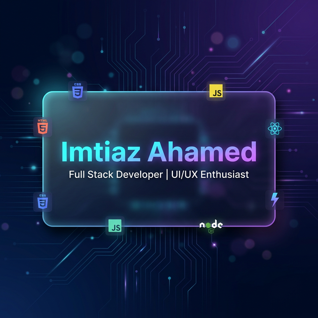

#  Hi, I'm Imtiaz Ahamed

  
  
   

  ## ⚡ Web Designer & Aspiring Developer
  **Electrical Engineering Student | Crafting Responsive Web Experiences**

  

    
    
    
  

---

### � About Me
- � **Working on:** High-performance, user-focused web applications.
- 🌱 **Learning:** Deep diving into **Backend Architecture** and **Advanced Node.js**.
- 🛠️ **Experience:** Electrical Engineering background gives me a unique problem-solving edge in tech.
- ⚡ **Fun Fact:** I transitioned from circuits to code because I love building things people can interact with.

---

### 🛠️ Tech Stack

  

---

### � GitHub Analytics

  <table border="0">
    <tr>
      <td>
        
      </td>
      <td>
        
      </td>
    </tr>
  </table>
  

---

### 📬 Let's Connect
I'm always open to collaborating on **Frontend**, **WordPress**, or **Open Source** projects. Feel free to reach out!

  

